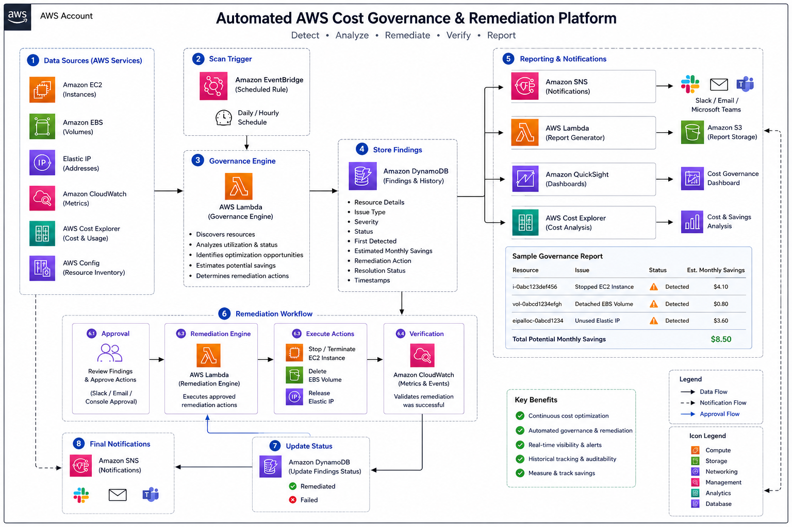
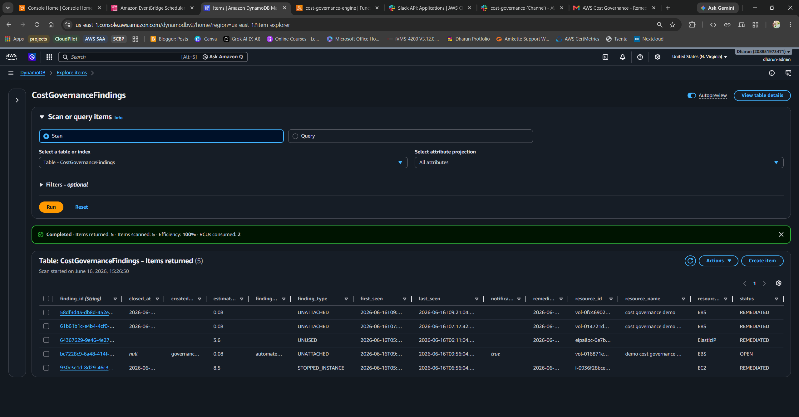
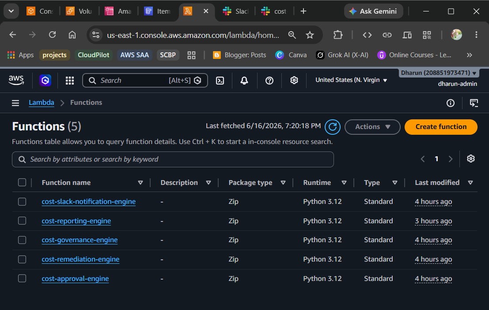
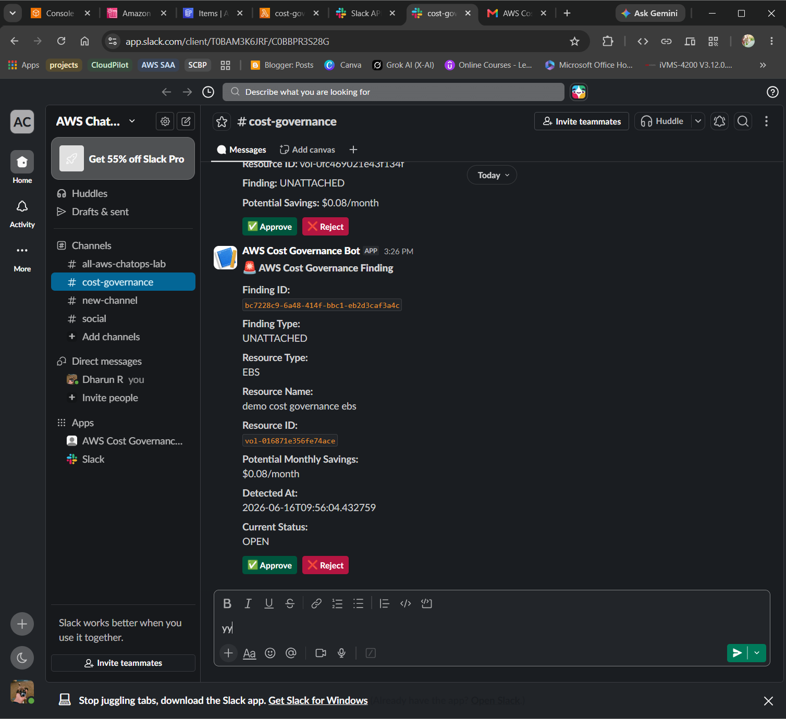
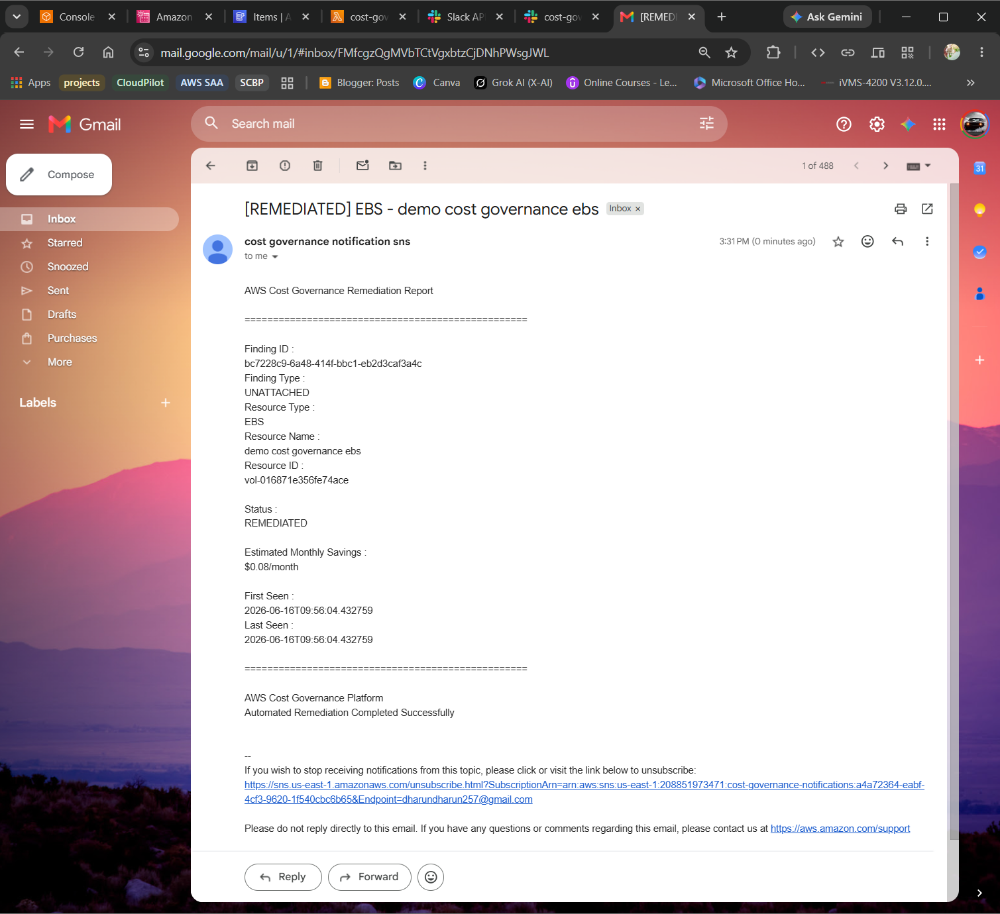
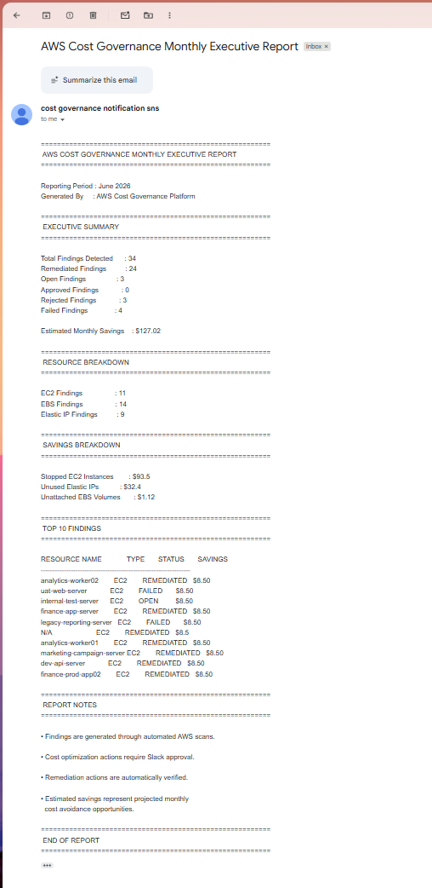

# 💸 Automated AWS Cost Governance & Remediation Platform

### Event-Driven FinOps Automation on AWS — Production-Inspired Serverless FinOps Platform

[](https://aws.amazon.com/)
[](https://aws.amazon.com/lambda/)
[](https://aws.amazon.com/dynamodb/)
[](https://aws.amazon.com/eventbridge/)
[](https://slack.com/)
[](https://www.python.org/)
[](https://www.finops.org/)

**A production-inspired, serverless FinOps platform that continuously detects cloud waste, routes findings through a Slack-based human approval workflow, automatically remediates approved resources, verifies outcomes, and delivers executive governance reports — all without a single server to manage.**

---

## 🏆 What This Project Demonstrates

This project was built to demonstrate real-world AWS cloud governance, FinOps engineering, and event-driven serverless architecture — not tutorials, not labs. Every component was designed, configured, and validated hands-on.

| Skill Area | What I Built |
|---|---|
| ☁️ AWS Architecture | Fully serverless event-driven platform using Lambda, EventBridge, DynamoDB, SNS, S3, API Gateway |
| ⚡ Serverless Design | Modular Lambda functions — each stage independently invocable and scalable |
| 💰 FinOps & Cost Governance | Automated detection of unused EIPs, unattached EBS, and stopped EC2 instances |
| 🤖 ChatOps Workflow | Slack-based Approve / Reject approval gates before any destructive action |
| 🔒 Security | Least-privilege IAM per Lambda, approval-gated remediation, full audit trail in DynamoDB |
| 📊 Executive Reporting | Monthly governance reports with savings summaries, resource breakdowns, and remediation metrics |
| 🛡️ Reliability | Post-remediation verification logic confirming resource removal before marking findings complete |

---

## ☁️ Cloud Architecture



The architecture is fully serverless and event-driven. No persistent compute, no orchestration servers, no infrastructure to patch.

Key design decisions:

- Modular Lambda functions per concern — detection, notification, approval, remediation, verification, reporting
- Findings persisted in DynamoDB with full lifecycle state for audit history and status management
- Human-in-the-loop approval via Slack before any resource is deleted
- Duplicate detection and notification deduplication built in by design
- Post-remediation verification runs as a distinct stage — separating "act" from "confirm"

---

## 🔄 Solution Flow

Every detected resource waste finding follows this automated governance lifecycle:

```
Amazon EventBridge (5-min schedule)
         │
         ▼
Cost Governance Engine (Lambda)
  ├── Scan EC2  → Stopped Instances
  ├── Scan EBS  → Unattached Volumes
  └── Scan EIP  → Unused Elastic IPs
         │
         ▼
Amazon DynamoDB
  └── Store findings with metadata, savings estimate, and OPEN status
         │
         ▼
Slack Notification Engine (Lambda)
  └── Format & send findings → Slack Channel
         │  [Approve] [Reject] buttons
         ▼
Amazon API Gateway
  └── Receives Slack interaction payload
         │
         ▼
Approval Engine (Lambda)
  ├── APPROVED → update DynamoDB status
  └── REJECTED → close finding
         │
         ▼
Amazon EventBridge (5-min schedule)
         │
         ▼
Remediation Engine (Lambda)
  ├── Release Elastic IP
  ├── Delete Unattached EBS Volume
  └── Terminate Stopped EC2 Instance
         │
         ▼
Verification Logic (Lambda)
  ├── ✅ Resource removed → REMEDIATED
  └── ❌ Resource still exists → FAILED
         │
         ├── Amazon SNS → Email Notification
         └── Amazon DynamoDB → Final Status Update
                  │
                  ▼ (Monthly)
         Reporting Engine (Lambda)
           ├── Amazon S3 → Store Report (HTML / CSV)
           └── Amazon SNS → Executive Report via Email
```

---

## 💡 Business Problem

Cloud environments accumulate waste by default. Without continuous governance, unused resources quietly drain budgets month after month.

| Resource | Waste Scenario | Typical Monthly Cost |
|---|---|---|
| 🖥️ Amazon EC2 | Instance left in stopped state | Variable by instance type |
| 💾 Amazon EBS | Volume detached from terminated instance | ~$0.10 / GB / month |
| 🌐 Elastic IP | Address allocated but not associated | ~$3.60 / IP / month |

Manual identification and cleanup is reactive, inconsistent, and doesn't scale. This platform treats cloud cost governance as a **continuous automated engineering workflow** — not a periodic operational task.

---

## 🛠️ Tech Stack

| Category | Tools |
|---|---|
| Governance & Detection | AWS Lambda, Amazon EC2, Amazon EBS, Elastic IP |
| Findings Storage | Amazon DynamoDB |
| Scheduling | Amazon EventBridge |
| ChatOps Approval | Slack API, Incoming Webhooks, Interactivity |
| API Layer | Amazon API Gateway |
| Notifications | Amazon SNS |
| Report Storage | Amazon S3 |
| Monitoring | Amazon CloudWatch |
| Access Control | AWS IAM |
| Language | Python, Boto3 |

---

## 📁 Repository Structure

```
automated-aws-cost-governance/
│
├── governance-engine/           # Resource discovery and findings creation
├── slack-notification-engine/   # Findings formatting and Slack delivery
├── approval-engine/             # Slack interaction handling and status updates
├── remediation-engine/          # Approved finding execution and verification
├── reporting-engine/            # Executive report generation and delivery
│
├── screenshots/
│   ├── architecture.png
│   ├── governance-engine.png
│   ├── dynamodb-findings.png
│   ├── slack-finding.png
│   ├── slack-approval.png
│   ├── remediation-email.png
│   └── executive-report.png
│
└── README.md
```

---

## 📖 Implementation Walkthrough

### Step 1 — Design the Governance Data Model

The DynamoDB Findings Table is the backbone of the entire platform. Every resource finding flows through a defined lifecycle stored here.

**Finding Lifecycle:**

```
OPEN → APPROVED → REMEDIATING → VERIFYING → REMEDIATED
                                          ↘ FAILED
     → REJECTED
```

**Key DynamoDB Attributes:**

| Attribute | Description |
|---|---|
| `finding_id` | Unique identifier per finding |
| `resource_id` | AWS Resource ID (EIP AllocationId, EBS VolumeId, EC2 InstanceId) |
| `resource_type` | `EC2` / `EBS` / `ElasticIP` |
| `estimated_savings` | Projected monthly cost savings |
| `status` | Current finding state in the lifecycle |
| `first_seen` | When the resource was first detected as wasteful |
| `approved_at` | Timestamp of Slack approval |
| `remediated_at` | Timestamp of successful remediation |
| `notification_sent` | Boolean flag — ensures each finding notifies exactly once |



---

### Step 2 — Build the Governance Engine

The Cost Governance Engine Lambda runs on a 5-minute EventBridge schedule and scans three resource types.

**Detection Logic:**

```
Elastic IP  → DescribeAddresses()  → No AssociationId  → UNUSED
EBS Volume  → DescribeVolumes()    → State = available → UNATTACHED
EC2 Instance→ DescribeInstances()  → State = stopped   → STOPPED_INSTANCE
```

Before creating any new finding, the engine checks for existing active records (`OPEN`, `APPROVED`, `REMEDIATING`, `VERIFYING`) — preventing duplicate findings and notification spam on every scan cycle.



---

### Step 3 — Set Up the Slack ChatOps Application

A custom Slack application was created with Incoming Webhooks and Interactivity enabled.

The Slack Notification Engine Lambda reads all unsent findings (`status = OPEN`, `notification_sent = false`), formats them into rich Slack messages, and delivers interactive blocks with **Approve** and **Reject** action buttons.

Once delivered, `notification_sent` is set to `true` — each finding sends exactly one Slack notification, regardless of how many scan cycles run.


---

### Step 4 — Configure the Approval Workflow

Amazon API Gateway exposes a public HTTPS endpoint that receives Slack interaction payloads when operators click Approve or Reject.

The Approval Engine Lambda resolves the action and updates DynamoDB:

```
Approve Click → Slack → API Gateway → Approval Engine Lambda
  └── finding status: OPEN → APPROVED
  └── approved_at: <timestamp>

Reject Click → Slack → API Gateway → Approval Engine Lambda
  └── finding status: OPEN → REJECTED
  └── rejected_at: <timestamp>
```

No resource is ever deleted without explicit human approval from this workflow.



---

### Step 5 — Automated Remediation Engine

A second EventBridge schedule triggers the Remediation Engine Lambda every 5 minutes. It queries DynamoDB for all `APPROVED` findings and dispatches the appropriate AWS action.

**Remediation Actions by Resource Type:**

| Resource | AWS Action |
|---|---|
| Elastic IP | `ec2.release_address(AllocationId)` |
| EBS Volume | `ec2.delete_volume(VolumeId)` |
| EC2 Instance | `ec2.terminate_instances(InstanceIds)` |

During execution, finding status transitions from `APPROVED → REMEDIATING` — preventing any concurrent Lambda invocation from double-processing the same finding.

---

### Step 6 — Post-Remediation Verification

Verification runs as a distinct Lambda stage after every remediation action — cleanly separating "act" from "confirm."

```
Elastic IP  → DescribeAddresses(AllocationId)  → ResourceNotFound → ✅ REMEDIATED
EBS Volume  → DescribeVolumes(VolumeId)        → ResourceNotFound → ✅ REMEDIATED
EC2 Instance→ DescribeInstances(InstanceId)    → State: terminated→ ✅ REMEDIATED

If resource still exists after action:
  └── Status → ❌ FAILED (surfaces accurately — no false REMEDIATED)
```

DynamoDB is updated with the final status and `remediated_at` timestamp.

---

### Step 7 — Notifications & Executive Reporting

Successful remediations trigger Amazon SNS publish events, delivering operational email notifications with resource details, finding type, and estimated savings.

A monthly EventBridge schedule invokes the Reporting Engine Lambda, which aggregates all findings and generates an executive governance report.

**Report Contents:**

- Executive Summary (total findings, total savings)
- Resource breakdown by type
- Savings breakdown
- Status distribution (Remediated / Failed / Rejected)
- Top findings by estimated savings

Reports are stored in Amazon S3 (HTML/CSV) and emailed via SNS.





---

## 📊 AWS Services Used

| Service | Role |
|---|---|
| AWS Lambda | Governance, Notification, Approval, Remediation, Verification, Reporting |
| Amazon DynamoDB | Findings store — lifecycle state, metadata, and audit history |
| Amazon EventBridge | Scheduled triggers for scans, remediation runs, and monthly reports |
| Amazon SNS | Remediation notifications and executive report email delivery |
| Amazon S3 | Executive report archival (HTML/CSV) |
| Amazon API Gateway | Public webhook endpoint for Slack interaction payloads |
| Amazon EC2 | Resource discovery and remediation target |
| Amazon CloudWatch | Lambda execution logs and operational monitoring |
| AWS IAM | Least-privilege execution roles per Lambda function |
| Slack API | ChatOps approval workflow — Webhooks and Interactivity |

---

## 🧠 Engineering Decisions

> Every design choice has a reason. These reflect real production thinking — not defaults.

| Decision | Why |
|---|---|
| Event-driven, modular Lambdas | Each concern is independently deployable, debuggable, and scalable — no monolith |
| Human approval before all destructive actions | Prevents accidental resource deletion — governance over speed |
| Deduplication by active status check | Safe to run on 5-minute schedules without flooding Slack or DynamoDB |
| `notification_sent` flag | Ensures operators receive each finding exactly once, regardless of scan frequency |
| Separate verification Lambda | Cleanly separates "act" from "confirm" — enables accurate REMEDIATED vs FAILED tracking |
| Full lifecycle timestamps in DynamoDB | Complete audit trail from detection to closure with no external logging dependency |
| Findings as source of truth | DynamoDB serves as discovery store, approval record, remediation tracker, and report data source simultaneously |
| SNS for all outbound notifications | Decouples Lambda from delivery mechanism — email, SMS, or further Lambda triggers without code changes |

---

## 🔐 Security Architecture

| Control | Purpose |
|---|---|
| Least-Privilege IAM per Lambda | Each function scoped only to actions it requires — Governance Engine has read-only EC2, Remediation Engine has targeted write-only |
| Approval-Gated Remediation | No destructive action executes without explicit Slack approval — system cannot self-approve |
| Auditable Finding Lifecycle | Every status transition timestamped and persisted in DynamoDB — permanent governance record |
| No Long-Running Credentials | Lambda functions assume IAM roles at execution time — no access keys stored anywhere |
| CloudWatch Centralized Logging | All Lambda executions emit structured logs — full operational review and incident investigation capability |

---

## 🏗️ AWS Well-Architected Alignment

**Cost Optimization *(Primary Pillar)***
The platform directly operationalizes cost optimization — continuously discovering idle resources, tracking estimated savings per finding, and automating remediation at scale. Governance is treated as an ongoing engineering discipline, not a one-time audit.

**Operational Excellence**
All governance operations run through automated, auditable, event-driven workflows. Slack integration enables operators to act on findings without leaving their existing tools. CloudWatch provides full observability across every Lambda execution.

**Security**
Remediation is gated behind explicit human approval. Each Lambda function operates under a dedicated least-privilege IAM role. The full findings lifecycle in DynamoDB provides a permanent, auditable record of every governance decision.

**Reliability**
Verification logic runs as a distinct post-remediation stage, independently confirming resource removal before marking findings complete. Failed remediations are surfaced accurately. Deduplication logic prevents double-processing across concurrent executions.

**Sustainability**
Systematically identifying and removing idle cloud resources reduces unnecessary compute and storage consumption — supporting efficient infrastructure utilization.

---

## 💼 Skills Demonstrated

**AWS Cloud Services**

`AWS Lambda` `Amazon DynamoDB` `Amazon EventBridge` `Amazon SNS` `Amazon S3` `Amazon API Gateway` `Amazon EC2` `Amazon EBS` `Elastic IP` `Amazon CloudWatch` `AWS IAM`

**Cloud Architecture & Design**

`Serverless Architecture` `Event-Driven Design` `Modular Lambda Functions` `Least-Privilege IAM` `Audit Trail Design` `State Machine in DynamoDB`

**FinOps & Cost Governance**

`Cloud Waste Detection` `Cost Optimization Automation` `Savings Estimation` `Executive Reporting` `FinOps Workflow Engineering`

**ChatOps & Integrations**

`Slack API` `Incoming Webhooks` `Interactive Slack Messages` `API Gateway Webhook Endpoint` `Human-in-the-Loop Automation`

**Development**

`Python` `Boto3` `REST API Integration` `Event-Driven Workflows`

---

## 🚀 Future Roadmap

- [ ] Multi-Account Governance via AWS Organizations cross-account IAM roles
- [ ] Cost Anomaly Detection integration for spend-based alerting
- [ ] Amazon QuickSight real-time governance dashboards
- [ ] PDF report generation for executive delivery
- [ ] Cost Explorer integration for historical savings validation and forecasting
- [ ] Terraform IaC deployment for full infrastructure-as-code provisioning
- [ ] SNS → Slack pipeline for remediation notifications inside Slack channel

---

## 👨‍💻 Author

**Dharun R**

---

*Built end-to-end on AWS to demonstrate serverless architecture, event-driven design, FinOps automation, ChatOps governance workflows, and AWS Well-Architected Framework practices.*
